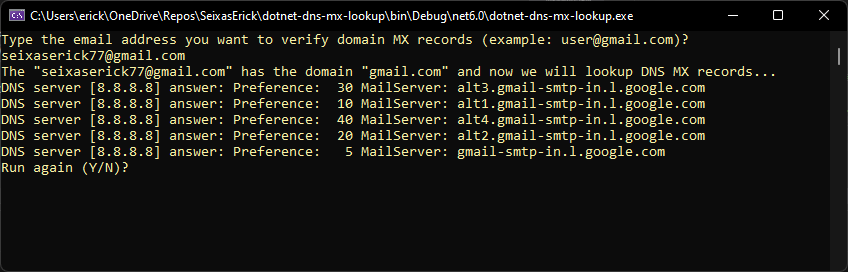

# C# native DNS MX servers Lookup (no dependencies)


 
# Context
Sometimes we need to check if an email has a valid domain and if this domain has MX records well configured.

This can be used for many proposals such as email validations before form submission, avoiding bounce rates before sending an email to AWS SES, SendGrid or another email provider, cleaning out old database of CRM with primary validation etc.


# What does this application do?
- The app asks what email do you want to verify MX records
- Then, it runs DNS MX  lookup and shows all mail servers with each server preference (priority)
- Alfer all, asks if you want to run again the app or if you want to quit the program
 
    

# Stack and main topics in the project
- .NET 6.0 console application
    - C# 
    - UDP protocol communication
    - Console input, output and cleaning
    - DNS MX protocol standard usage
    
- Docker
    - docker build
    - docker run
    - docker container bash interaction (from docker's host shell)


# About the Author and license
- **Erick** is a Senior Backend Developer and Architect. 
- You can reach **Erick** by email <seixaserick77@gmail.com> or Linkedin <https://www.linkedin.com/in/seixaserick/>
- Other Github Repositories: <https://github.com/seixaserick/> 
- MIT License (please check [LICENSE.txt](LICENSE.txt) for more details)


# How to run this project 

## Clone the repository

If you already installed Git for Windows, run commands below:
```
git clone https://github.com/seixaserick/dotnet-dns-mx-lookup
cd dotnet-dns-mx-lookup
```


# How to run this project in Docker containers
> If you already installed Docker Desktop, just follow these steps below


## Creating a docker image
To create a Docker image, run command line below in the command prompt of project directory:
```
docker build -t dotnet-dns-mx-lookup -f Dockerfile .
```


## Running the app in a docker container


To run the image in Docker container and interact with it, run command line below: 
```
docker run -it --name=dotnet-dns-mx-lookup --restart=unless-stopped dotnet-dns-mx-lookup
```

To stop the container, run command line below: 
```
docker stop dotnet-dns-mx-lookup
```

To remove the container (even if it is running), run command line below: 
```
docker rm --force dotnet-dns-mx-lookup
```


# How to build and run without Docker (Windows)

> After clone the repository you can open the project with Visual Studio. Build or just debug it pressing ```F5```.

## To compile and run it in Windows (Visual Studio required)
> Open the solution file ```dotnet-dns-mx-lookup.sln``` with your Visual Studio, then press ```F5``` to run the project!


# Takeaways

- DNS protocol uses UPD protocol port 53
- An email domain my have more than one MX record and you should communicate with high priority servers
- Dotnet apps (console or not) can run in Linux or Windows OS.
- Docker is a nice tool to run projects quickly without concern about dependencies and configurations.
- C# is very similar to other ECMA-based languages (Java, Javascript etc.)
- Console apps are simple and easy to input and output data.
- Good Markdown README.md files can help other developers to understand, clone, run and test projects.

# Homework challenge

1. Try to implement a email validation function to return true if an email has at least one valid server domain
2. Try to sort DNS MX servers list by server preference before print it on console.
3. Try to check if each DNS server IP is valid and call its TCP 25, 587 or 465 ports (common SMTP ports). Tip: Use native dotnet DNS A record query to find server's IP (IPv4 or IPv6) <https://docs.microsoft.com/en-us/dotnet/api/system.net.dns?view=net-6.0>
4. Inspect the code, increase the DNS query timeout and force a network disconnection between one DNS server lookup (unplug your ethernet card and wi-fi) to see what happens. Try to implement an error handling for timeout error. You can simulate primary DNS failing and secondary DNS returning the query (after reconnect your network).
5. Inspect the Dockerfile content to see how docker pulls imagens from images's hub
6. Try to create a WebAPI and implement an endpoint to check if an email is valid (https://my-api-server.com/api/emailcheck?email=user@gmaaaaail.com). You can use this in your website to prevent fake emails (with invalid domains) to contact you by form submmiting.
7. Try to implement a domain MX records CACHE using native dotnet memory cache or REDIS distributed cache.

